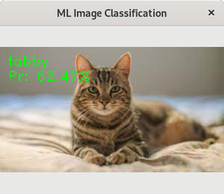

# CppND: Capstone Project
## Neural Network Deployment / ML Image Classification

This is the capstone project for the [Udacity C++ Nanodegree Program](https://www.udacity.com/course/c-plus-plus-nanodegree--nd213). 

For the capstone project, I chose to deploy a deep learning convolutional neural network to perform an image classification demonstration.  This application uses the pre-trained [Inception v3](https://en.wikipedia.org/wiki/Inceptionv3) model trained with [Tensorflow](https:://www.tensorflow.org).

In addition to the main thread:

+ A graphics thread is started to display images to the user in a window.  The thread looks for images, their classification, and the probablity of the model's confidence in that classification.  Each time a result is available, the graphics thread will draw the image and overlay its classification and probablity.

+ A classification demonstrator thread is also started.  The demonstrator initializes by finding all image files within the _images/_ directory.  The demonstrator loops through these images in a circular/ringed fashion, classifying an image and messaging the results to the graphics thread for display.  The classification demonstrator pauses for a handful of seconds after each classification is performed.

+ The user can exit the application gracefully by pressing any key on the keyboard, which signals the graphics and demonstrator threads' Run methods to complete, and each thread will be joined before the main thread completes.

## Dependencies for Running Locally
* cmake >= 2.8
  * All OSes: [click here for installation instructions](https://cmake.org/install/)
* make >= 4.1 (Linux, Mac), 3.81 (Windows)
  * Linux: make is installed by default on most Linux distros
  * Mac: [install Xcode command line tools to get make](https://developer.apple.com/xcode/features/)
  * Windows: [Click here for installation instructions](http://gnuwin32.sourceforge.net/packages/make.htm)
* OpenCV >= 4.1
  * The OpenCV 4.1.0 source code can be found [here](https://github.com/opencv/opencv/tree/4.1.0)
* gcc/g++ >= 8 (for std::filesystem usage)
  * Linux: gcc / g++ is installed by default on most Linux distros
  * Mac: same deal as make - [install Xcode command line tools](https://developer.apple.com/xcode/features/)
  * Windows: recommend using [MinGW](http://www.mingw.org/)

## Basic Build Instructions

1. Clone this repo.
2. Make a build directory in the top level directory: `mkdir build && cd build`
3. Compile: `cmake .. && make`
4. Run it: `./ml_classification`.

## Rubric Notes

### **Organization / OOP**
The application is organized into 4 main classes and a main function.
+ The **Graphics** class (_src/Graphics.(h|cpp)_) is responsible for managing the UI window, displaying images; and overlaying the image classification and the confidence in that classification for the user to see.
+ The **ClassificationDemo** (_src/ClassificationDemo.(h|cpp)_) class contains the logic which drives the demonstration for the user.  It is composed of a MLClassifier, and a MessageQueue.
+ The **MLClassifier** (_src/MLClassifier.(h|cpp)_) class is responsible for loading and interfacing with the pre-trained neural network.
+ The **MessageQueue** (_src/ClassificationDemo.(h|cpp)_) class is a modified version of the MessageQueue class which appears in the traffic simulation project.
+ The main function which instantiates the objects, and in turn starts the threads too is defined within _src/Main.cpp_
+ Member variables set to argument values initialized using initialization list.  For examples, please see: _src/ClassificationDemo.cpp lines: 44-46_ & _src/MLClassifier.cpp lines: 7-9_
+ As is in in the concurrency project, MessageQueue is a generic / template class, accepting any type of for the messages within its deque.  Please see _src/ClassificationDemo.h lines: 23-33_

### **Loops, Functions, I/O**
The program uses a variety of conditional statements, iteration / looping, edge cases / exception conditions, functions, etc.  A few examples can be seen here:

+ Namespaced utility function declaration: _src/ClassificationDemo.h line:19_
+ Function definition including looping, conditional statements, filesystem I/O, etc.  _src/ClassificationDemo.cpp lines 8-21_
+ The program accepts user input from the keyboard to signal for a graceful exit.  _src/Main.cpp lines: 13-15_

### **Memory Management**
The program utilizes pointers, smart pointers, and has functions / methods that accept arguments by reference:

+  _src/Main.cpp lines: 6-9_.  Creates new ClassificationDemo and Graphics objects on the heap.  Lines: 20-21 delete these objects on program termination.
+ _src/Graphics.cpp line 13_.  Uses the class destructor to ensure opencv::Window resources are properly released.
+ _src/ClassificationDemo.h line: 59_ declares a unique_ptr member to hold the MLClassfier object, utilizing smart pointers and the scope of the ClassificationDemo instance to manage the MLClassifier object lifespan and clean up.
+ _src/ClassificationDemo.cpp Line: 79_ is one example of a method which takes a int& reference.  This method accepts a reference parameter so that it can be updated before returning to the caller, enabling the method to manage the position within the vector of images, and importantly, wrapping the position back to the beginning once the end is reached.
+ Copy and move constructors and assignment operators are deleted from Graphics, ClassificationDemo, and MessageQueue classes as they contain mutex, condition_variable, and unique_ptr variables.  The default constructor and destructor is implemented in these classes.
+ The rule of five is also implemented for MLClassifier class, and, this class provides full implementations for copy, move, and assignment.

### **Multithreading**
The application spawns two threads:

+ _src/Graphics.cpp line: 19_  & 
+ _src/ClassificationDemo.cpp line: 54_

The threads communicate using a MessageQueue object, similar to the one used in the traffic simulation, but with some minor enhancements.  See:

+ _src/ClassificationDemo.h lines: 23 - 33_

The MessageQueue employs a mutex and condition_variable for safely synchronizing access to shared data and notifying threads when new data has arrived.  For examples, See: _src/ClassificationDemo.cpp_

+ line 25-26 usage of unique_lock and condition_variable::wait
+ line 33 & 35 lock_guard and condition_variable::notify_one usage.

The Graphics and ClassificationDemo classes also employ a std::mutex member variable along with an std::atomic<bool>.  And their Start and Stop methods utilize a std::lock_guard to synchronize starting and stopping of their threads.  See:

+ Graphics::Start, Graphics::Stop, & Graphics::Run (_src/Graphics.cpp lines: 15-21, 24,  & 37-43_)
+ ClassificationDemo::RunDemo, ClassificationDemo::Stop, & ClassificationDemo::Run (_src/ClassificationDemo.cpp lines: 50-56, 64, 101-107_)

